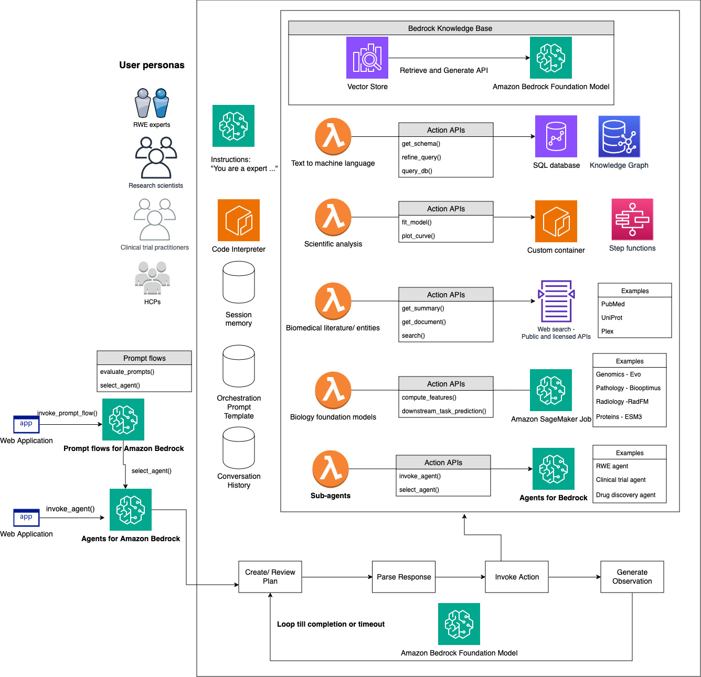

# awesome-aiml-hcls

A curated list of awesome references for agentic workflows with Generative AI across the HCLS value chain

[Solution template](https://github.com/aws-samples/amazon-bedrock-agents-cancer-biomarker-discovery)

* [**Research and Development**](./Research_and_Development.md)
  - [Biomarker discovery with LLM agents](./Research_and_Development.md#Biomarker-discovery-with-LLM-agents)
  - [Drug Design and Drug Discovery](./Research_and_Development.md#drug-discoverydrug-design)
  - [Medical Imaging](./Research_and_Development.md#medical-imaging)
  - [Knowledge Graph ](./Research_and_Development.md#knowledge-graph) 
  - [Multi-modal ML](./Research_and_Development.md#multi-modal-ml)
  - [Customer references](./Research_and_Development.md#customer-references)

* [**Clinical Development**](Clinical_Development.md) 
  - [Clinical Trials](./Clinical_Development.md#clinical-trials)
  - [Customer references](./Clinical_Development.md#customer-references)

* [**Manufacturing**](manufacturing.md)   

* [**Commercial and Medical Affairs**](Commercial_and_Medical_Affairs.md) 
  - [Pharmacovigilance](./Commercial_and_Medical_Affairs.md#pharmacovigilance)
  - [Digital Therapeutics](./Commercial_and_Medical_Affairs.md#digital-therapeutics)
  - [Customer references](./Commercial_and_Medical_Affairs.md#customer-references)

* [**GenAI Platform**](ML_platform.md)
  - [Guidance for a Multi-Tenant, Generative AI Gateway with Cost and Usage Tracking on AWS](https://aws.amazon.com/solutions/guidance/multi-tenant-generative-ai-gateway-with-cost-and-usage-tracking-on-aws/)
  - [Build a multi-tenant generative AI environment for your enterprise on AWS](https://aws.amazon.com/blogs/machine-learning/build-a-multi-tenant-generative-ai-environment-for-your-enterprise-on-aws/)
  - [Implementing tenant isolation using Agents for Amazon Bedrock in a multi-tenant environment](https://aws.amazon.com/blogs/machine-learning/implementing-tenant-isolation-using-agents-for-amazon-bedrock-in-a-multi-tenant-environment/)

* [**Other resources**]
  - [Machine Learning Best Practices in Healthcare and Life Sciences](https://docs.aws.amazon.com/whitepapers/latest/ml-best-practices-healthcare-life-sciences/ml-best-practices-healthcare-life-sciences.html)
  - [Best practices for building robust generative AI applications with Amazon Bedrock Agents – Part 1](https://aws.amazon.com/blogs/machine-learning/best-practices-for-building-robust-generative-ai-applications-with-amazon-bedrock-agents-part-1/)
  - [Best practices for building robust generative AI applications with Amazon Bedrock Agents – Part 2](https://aws.amazon.com/blogs/machine-learning/best-practices-for-building-robust-generative-ai-applications-with-amazon-bedrock-agents-part-2/)
  - [Multi-agent orchestrator](https://awslabs.github.io/multi-agent-orchestrator/general/how-it-works/)
  - [Agents and function calling with Bedrock samples](https://github.com/aws-samples/amazon-bedrock-samples/tree/main/agents-and-function-calling)
 
 * [**Bedrock Agent architecture**]
   

## Contributing
If you'd like to open an issue, for having a defunct link removed or corrected, or you want to propose interesting content and share it into the list through a pull request, please read our [contributing guidelines]. The pull request will be evaluated by the project owners and incorporated into the list. Please ensure that you add the link to the appropriate sub-page and the link points to unique content that is not already covered by one of the other links. We're extremely excited to receive contributions from the community, and we're still working on the best mechanism to take in examples from external sources.

## Authors and acknowledgment
Show your appreciation to those who have contributed to the project.

## License
For open source projects, say how it is licensed.

